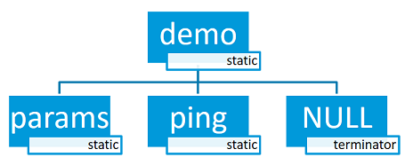
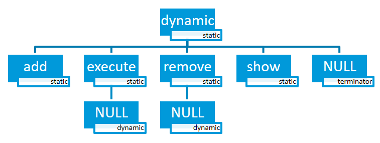

.. _shell_api:

Shell
######

.. contents::
    :local:
    :depth: 2

概述 (Overview)
***************

此模块允许您使用用户定义的命令集创建和处理 shell。您可以在需要超过简单按钮或 LED 用户交互的示例中使用它。此模块是一个类 Unix shell,具有以下功能:(This module allows you to create and handle a shell with a user-defined command set. You can use it in examples where more than simple button or LED user interaction is required. This module is a Unix-like shell with these features:)

* 支持多个实例。(Support for multiple instances.)
* 与 :ref:`logging_api` 的高级协作。(Advanced cooperation with the :ref:`logging_api`.)
* 支持静态和动态命令。(Support for static and dynamic commands.)
* 支持字典命令。(Support for dictionary commands.)
* 使用 :kbd:`Tab` 键智能命令完成。(Smart command completion with the :kbd:`Tab` key.)
* 内置命令::command:`clear`、:command:`shell`、:command:`colors`、:command:`echo`、:command:`history` 和 :command:`resize`。(Built-in commands: :command:`clear`, :command:`shell`, :command:`colors`, :command:`echo`, :command:`history` and :command:`resize`.)
* 使用 :kbd:`↑` :kbd:`↓` 或元键查看最近执行的命令。(Viewing recently executed commands using keys: :kbd:`↑` :kbd:`↓` or meta keys.)
* 使用键进行文本编辑::kbd:`←`、:kbd:`→`、:kbd:`Backspace`、:kbd:`Delete`、:kbd:`End`、:kbd:`Home`、:kbd:`Insert`。(Text edition using keys: :kbd:`←`, :kbd:`→`, :kbd:`Backspace`, :kbd:`Delete`, :kbd:`End`, :kbd:`Home`, :kbd:`Insert`.)
* 支持 ANSI 转义码:``VT100`` 和 ``ESC[n~`` 用于光标控制和颜色打印。(Support for ANSI escape codes: ``VT100`` and ``ESC[n~`` for cursor control and color printing.)
* 支持编辑多行命令。(Support for editing multiline commands.)
* 内置处理程序以显示命令的帮助。(Built-in handler to display help for the commands.)
* 支持通配符:``*`` 和 ``?``。(Support for wildcards: ``*`` and ``?``.)
* 支持元键。(Support for meta keys.)
* 支持 getopt 和 getopt_long。(Support for getopt and getopt_long.)
* Kconfig 配置以优化内存使用。(Kconfig configuration to optimize memory usage.)

.. note::
	这些功能中的一些对 RAM 和闪存使用有重大影响,但许多功能在不需要时可以禁用。要默认选择有利于减少 RAM 和闪存需求而非功能的选项,您应该启用 :kconfig:option:`CONFIG_SHELL_MINIMAL` 并有选择地仅启用您想要的功能。(Some of these features have a significant impact on RAM and flash usage, but many can be disabled when not needed.  To default to options which favor reduced RAM and flash requirements instead of features, you should enable :kconfig:option:`CONFIG_SHELL_MINIMAL` and selectively enable just the features you want.)

.. _backends:

后端 (Backends)
***************

该模块可以连接到任何用于命令输入和输出的传输层。目前,已实现以下传输层:(The module can be connected to any transport for command input and output. At this point, the following transport layers are implemented:)

* MQTT
* Segger RTT
* SMP
* Telnet
* UART
* USB
* Bluetooth LE (NUS)
* RPMSG
* DUMMY - 不是物理传输层。(DUMMY - not a physical transport layer.)

Telnet
======

启用 :kconfig:option:`CONFIG_SHELL_BACKEND_TELNET` 将允许用户使用 telnet 作为 shell 后端。可以使用 PuTTY 或任何 ``telnet`` 客户端连接到它。例如:(Enabling :kconfig:option:`CONFIG_SHELL_BACKEND_TELNET` will allow users to use telnet as a shell backend. Connecting to it can be done using PuTTY or any ``telnet`` client. For example:)

.. code-block:: none

  telnet <ip address> <port>

默认情况下,telnet 客户端不会处理 telnet 命令和配置。尽管可以使用 :kconfig:option:`CONFIG_SHELL_TELNET_SUPPORT_COMMAND` 启用命令支持。这将使 telnet 客户端能够访问非常有限的一组受支持的命令,但如果需要仍然可以打开。它支持的命令选项之一是 ``ECHO`` 选项。这将允许客户端处于字符模式(一次一个字符),在这方面类似于 UART 后端。这将使客户端在输入字符后立即发送字符,从而显著增加网络流量。为此代价,它将启用行编辑、`tab 完成 <tab-feature_>`_ 和 `历史 <history-feature_>`_ 功能。(By default the telnet client won't handle telnet commands and configuration. Although command support can be enabled with :kconfig:option:`CONFIG_SHELL_TELNET_SUPPORT_COMMAND`. This will give the telnet client access to a very limited set of supported commands but still can be turned on if needed. One of the command options it supports is the ``ECHO`` option. This will allow the client to be in character mode (character at a time), similar to a UART backend in that regard. This will make the client send a character as soon as it is typed having the effect of increasing the network traffic considerably. For that cost, it will enable the line editing, `tab completion <tab-feature_>`_, and `history <history-feature_>`_ features of the shell.)

USB CDC ACM
===========

要配置 Shell USB CDC ACM 后端,只需将代码片段 ``cdc-acm-console`` 添加到您的构建中:(To configure Shell USB CDC ACM backend, simply add the snippet ``cdc-acm-console`` to your build:)

.. code-block:: console

   west build -S cdc-acm-console [...]

配置设置的详细信息在以下文件中:(Details on the configuration settings are captured in the following files:)

- :zephyr_file:`snippets/cdc-acm-console/cdc-acm-console.conf`.
- :zephyr_file:`snippets/cdc-acm-console/cdc-acm-console.overlay`.

Bluetooth LE (NUS)
==================

要配置 Bluetooth LE (NUS) 后端,只需将代码片段 ``nus-console`` 添加到您的构建中:(To configure Bluetooth LE (NUS) backend, simply add the snippet ``nus-console`` to your build:)

.. code-block:: console

   west build -S nus-console [...]

配置设置的详细信息在以下文件中:(Details on the configuration settings are captured in the following files:)

- :zephyr_file:`snippets/nus-console/nus-console.conf`.
- :zephyr_file:`snippets/nus-console/nus-console.overlay`.

Segger RTT
==========

要配置 Segger RTT 后端,将以下配置添加到您的构建中:(To configure Segger RTT backend, add the following configurations to your build:)

- :kconfig:option:`CONFIG_USE_SEGGER_RTT`
- :kconfig:option:`CONFIG_SHELL_BACKEND_RTT`
- :kconfig:option:`CONFIG_SHELL_BACKEND_SERIAL`

有关其他配置设置的详细信息在以下文件中:(Details on additional configuration settings are captured in:)
:zephyr_file:`samples/subsys/shell/shell_module/prj_minimal_rtt.conf`.

.. _shell_rtt_west:

使用 west (Using west)
----------------------

使用以下命令附加和配置 RTT:(Attach to and configure RTT with:)

.. code-block:: console

   $ west rtt

.. note::

   如果您的默认运行器不支持 RTT,请查看您的开发板文档页面以查找支持 RTT 的任何其他运行器。然后,您可以使用 ``--runner`` 选项指定不同的运行器。(If your default runner does not have support for RTT, check your board's documentation page for any other runners that support RTT. You may then use the ``--runner`` option to specify a different runner.)

  .. code-block:: console

     $ west rtt --runner <runner>

.. _shell_rtt_putty:

使用 PuTTY (Using PuTTY)
------------------------

使用以下过程:(Use following procedure:)

* 打开调试会话并继续运行应用程序。(Open debug session and continue running the application.)

  .. code-block:: none

     west attach

* 打开 ``PuTTY``。使用 telnet 端口 19021 和特定的终端配置。将 ``Local echo`` 设置为 ``Force off``,将 ``Local line editing`` 设置为 ``Force off``(见下图)。(Open ``PuTTY``. Use telnet port 19021 and specific Terminal configuration. Set ``Local echo`` to ``Force off`` and ``Local line editing`` to ``Force off`` (see image below).)

.. image:: images/putty_rtt.png
      :align: center
      :alt: RTT PuTTY 终端配置 (RTT PuTTY terminal configuration).

* 现在您应该有一个到 RTT 的网络连接,允许您向 shell 输入内容。(Now you should have a network connection to RTT that will let you enter input to the shell.)

通过 TCP 连接到 Segger RTT(例如在 macOS 上) (Connecting to Segger RTT via TCP (on macOS, for example))
--------------------------------------------------------------------------------------------------------

在 macOS 上,JLinkRTTClient 不允许您输入内容。相反,请使用以下过程:(On macOS JLinkRTTClient won't let you enter input. Instead, please use following procedure:)

* 打开第一个终端窗口并输入:(Open up a first Terminal window and enter:)

  .. code-block:: none

     JLinkRTTLogger -Device NRF52840_XXAA -RTTChannel 1 -if SWD -Speed 4000 ~/rtt.log

  (如果需要,更改设备) ((change device if required))

* 打开第二个终端窗口并输入:(Open up a second Terminal window and enter:)

  .. code-block:: none

     nc localhost 19021

* 现在您应该有一个到 RTT 的网络连接,允许您向 shell 输入内容。但是,与 `PuTTY <shell_rtt_putty_>`_ 相反,某些功能(如 ``Tab`` 完成)不起作用。(Now you should have a network connection to RTT that will let you enter input to the shell. However, contrary to `PuTTY <shell_rtt_putty_>`_ some features like ``Tab`` completion do not work.)

命令 (Commands)
***************

Shell 命令以树结构组织,并分为以下类型:(Shell commands are organized in a tree structure and grouped into the following types:)

* 根命令(级别 0):在专用内存部分中收集并按字母顺序排序。(Root command (level 0): Gathered and alphabetically sorted in a dedicated memory section.)
* 静态子命令(级别 > 0):数量和语法必须在编译时已知。在软件模块中创建。(Static subcommand (level > 0): Number and syntax must be known during compile time. Created in the software module.)
* 动态子命令(级别 > 0):数量和语法不需要在编译时已知。在软件模块中创建。(Dynamic subcommand (level > 0): Number and syntax does not need to be known during compile time. Created in the software module.)

常用命令组 (Commonly-used command groups)
========================================

以下列表是一组有用的命令组以及如何启用它们:(The following list is a set of useful command groups and how to enable them:)

GPIO
----

- :kconfig:option:`CONFIG_GPIO`
- :kconfig:option:`CONFIG_GPIO_SHELL`

I2C
---

- :kconfig:option:`CONFIG_I2C`
- :kconfig:option:`CONFIG_I2C_SHELL`

Sensor
------

- :kconfig:option:`CONFIG_SENSOR`
- :kconfig:option:`CONFIG_SENSOR_SHELL`

Flash
-----

- :kconfig:option:`CONFIG_FLASH`
- :kconfig:option:`CONFIG_FLASH_SHELL`

File-System
-----------

- :kconfig:option:`CONFIG_FILE_SYSTEM`
- :kconfig:option:`CONFIG_FILE_SYSTEM_SHELL`

创建命令 (Creating commands)
============================

使用以下宏添加 shell 命令:(Use the following macros for adding shell commands:)

* :c:macro:`SHELL_CMD_REGISTER` - 创建根命令。所有根命令必须具有不同的名称。(Create root command. All root commands must have different name.)
* :c:macro:`SHELL_COND_CMD_REGISTER` - 有条件地(如果设置了编译时标志)创建根命令。所有根命令必须具有不同的名称。(Conditionally (if compile time flag is set) create root command. All root commands must have different name.)
* :c:macro:`SHELL_CMD_ARG_REGISTER` - 创建带参数的根命令。所有根命令必须具有不同的名称。(Create root command with arguments. All root commands must have different name.)
* :c:macro:`SHELL_COND_CMD_ARG_REGISTER` - 有条件地(如果设置了编译时标志)创建带参数的根命令。所有根命令必须具有不同的名称。(Conditionally (if compile time flag is set) create root command with arguments. All root commands must have different name.)
* :c:macro:`SHELL_CMD` - 初始化命令。(Initialize a command.)
* :c:macro:`SHELL_COND_CMD` - 如果设置了编译时标志,则初始化命令。(Initialize a command if compile time flag is set.)
* :c:macro:`SHELL_EXPR_CMD` - 如果编译时表达式非零,则初始化命令。(Initialize a command if compile time expression is non-zero.)
* :c:macro:`SHELL_CMD_ARG` - 初始化带参数的命令。(Initialize a command with arguments.)
* :c:macro:`SHELL_COND_CMD_ARG` - 如果设置了编译时标志,则初始化带参数的命令。(Initialize a command with arguments if compile time flag is set.)
* :c:macro:`SHELL_EXPR_CMD_ARG` - 如果编译时表达式非零,则初始化带参数的命令。(Initialize a command with arguments if compile time expression is non-zero.)
* :c:macro:`SHELL_STATIC_SUBCMD_SET_CREATE` - 创建静态子命令数组。(Create a static subcommands array.)
* :c:macro:`SHELL_SUBCMD_DICT_SET_CREATE` - 创建字典子命令数组。(Create a dictionary subcommands array.)
* :c:macro:`SHELL_DYNAMIC_CMD_CREATE` - 创建动态子命令数组。(Create a dynamic subcommands array.)

命令可以在系统中包含 :zephyr_file:`include/zephyr/shell/shell.h` 的任何文件中创建。所有创建的命令对所有 shell 实例都可用。(Commands can be created in any file in the system that includes :zephyr_file:`include/zephyr/shell/shell.h`. All created commands are available for all shell instances.)

静态命令 (Static commands)
--------------------------

演示如何使用静态子命令创建根命令的示例代码。(Example code demonstrating how to create a root command with static subcommands.)

.. code-block:: c

	/* Creating subcommands (level 1 command) array for command "demo". */
	SHELL_STATIC_SUBCMD_SET_CREATE(sub_demo,
		SHELL_CMD(params, NULL, "Print params command.",
						       cmd_demo_params),
		SHELL_CMD(ping,   NULL, "Ping command.", cmd_demo_ping),
		SHELL_SUBCMD_SET_END
	);
	/* Creating root (level 0) command "demo" */
	SHELL_CMD_REGISTER(demo, &sub_demo, "Demo commands", NULL);

示例实现可以在以下位置找到:(Example implementation can be found under following location:)
:zephyr_file:`samples/subsys/shell/shell_module/src/main.c`.

字典命令 (Dictionary commands)
==============================
这是一种特殊的静态命令。每次您想在命令处理程序中使用一对:(字符串 <-> 相应数据)时,都可以使用字典命令。字符串通常是给定数据的口头描述。这个想法是使用字符串作为可以由 shell 提示的命令语法,相应的数据可用于处理命令。(This is a special kind of static commands. Dictionary commands can be used every time you want to use a pair: (string <-> corresponding data) in a command handler. The string is usually a verbal description of a given data. The idea is to use the string as a command syntax that can be prompted by the shell and corresponding data can be used to process the command.)

让我们用一个例子。假设您创建了一个命令来设置 ADC 增益。这是一个可以使用字典的完美位置。字典将是一组对:(字符串: gain_value, int: value),其中 int 值可以与 ADC 驱动程序 API 一起使用。(Let's use an example. Suppose you created a command to set an ADC gain. It is a perfect place where a dictionary can be used. The dictionary would be a set of pairs: (string: gain_value, int: value) where int value could be used with the ADC driver API.)

此任务的抽象代码如下所示:(Abstract code for this task would look like this:)

.. code-block:: c

	static int gain_cmd_handler(const struct shell *sh,
				    size_t argc, char **argv, void *data)
	{
		int gain;

		/* data is a value corresponding to called command syntax */
		gain = (int)data;
		adc_set_gain(gain);

		shell_print(sh, "ADC gain set to: %s\n"
				   "Value send to ADC driver: %d",
				   argv[0],
				   gain);

		return 0;
	}

	SHELL_SUBCMD_DICT_SET_CREATE(sub_gain, gain_cmd_handler,
		(gain_1, 1, "gain 1"), (gain_2, 2, "gain 2"),
		(gain_1_2, 3, "gain 1/2"), (gain_1_4, 4, "gain 1/4")
	);
	SHELL_CMD_REGISTER(gain, &sub_gain, "Set ADC gain", NULL);

这是它在 shell 中的外观:(This is how it would look like in the shell:)

.. image:: images/dict_cmd.png
      :align: center
      :alt: 字典命令示例 (Dictionary commands example).

动态命令 (Dynamic commands)
---------------------------

演示如何使用静态和动态子命令创建根命令的示例代码。开始时动态命令列表为空。可以通过输入以下内容添加新命令:(Example code demonstrating how to create a root command with static and dynamic subcommands. At the beginning dynamic command list is empty. New commands can be added by typing:)

.. code-block:: none

	dynamic add <new_dynamic_command>

新添加的命令可以使用 :kbd:`Tab` 键提示或自动完成。(Newly added commands can be prompted or autocompleted with the :kbd:`Tab` key.)

.. code-block:: c

	/* Buffer for 10 dynamic commands */
	static char dynamic_cmd_buffer[10][50];

	/* commands counter */
	static uint8_t dynamic_cmd_cnt;

	/* Function returning command dynamically created
	 * in  dynamic_cmd_buffer.
	 */
	static void dynamic_cmd_get(size_t idx,
				    struct shell_static_entry *entry)
	{
		if (idx < dynamic_cmd_cnt) {
			entry->syntax = dynamic_cmd_buffer[idx];
			entry->handler  = NULL;
			entry->subcmd = NULL;
			entry->help = "Show dynamic command name.";
		} else {
			/* if there are no more dynamic commands available
			 * syntax must be set to NULL.
			 */
			entry->syntax = NULL;
		}
	}

	SHELL_DYNAMIC_CMD_CREATE(m_sub_dynamic_set, dynamic_cmd_get);
	SHELL_STATIC_SUBCMD_SET_CREATE(m_sub_dynamic,
		SHELL_CMD(add, NULL,"Add new command to dynamic_cmd_buffer and"
			  " sort them alphabetically.",
			  cmd_dynamic_add),
		SHELL_CMD(execute, &m_sub_dynamic_set,
			  "Execute a command.", cmd_dynamic_execute),
		SHELL_CMD(remove, &m_sub_dynamic_set,
			  "Remove a command from dynamic_cmd_buffer.",
			  cmd_dynamic_remove),
		SHELL_CMD(show, NULL,
			  "Show all commands in dynamic_cmd_buffer.",
			  cmd_dynamic_show),
		SHELL_SUBCMD_SET_END
	);
	SHELL_CMD_REGISTER(dynamic, &m_sub_dynamic,
		   "Demonstrate dynamic command usage.", cmd_dynamic);

示例实现可以在以下位置找到:(Example implementation can be found under following location:)
:zephyr_file:`samples/subsys/shell/shell_module/src/dynamic_cmd.c`.

命令执行 (Commands execution)
=============================

每个命令或子命令都可以有一个处理程序。shell 执行在命令树中找到的最深的处理程序,并将其他子命令(没有处理程序)作为参数传递。括号内的字符被视为一个参数。如果 shell 找不到处理程序,它将显示错误消息。(Each command or subcommand may have a handler. The shell executes the handler that is found deepest in the command tree and further subcommands (without a handler) are passed as arguments. Characters within parentheses are treated as one argument. If shell won't find a handler it will display an error message.)

还可以使用任何活动后端和函数 :c:func:`shell_execute_cmd` 从用户应用程序执行命令,如以下示例所示:(Commands can be also executed from a user application using any active backend and a function :c:func:`shell_execute_cmd`, as shown in this example:)

.. code-block:: c

	int main(void)
	{
		/* Below code will execute "clear" command on a DUMMY backend */
		shell_execute_cmd(NULL, "clear");

		/* Below code will execute "shell colors off" command on
		 * an UART backend
		 */
		shell_execute_cmd(shell_backend_uart_get_ptr(),
				  "shell colors off");
	}

通过设置 Kconfig :kconfig:option:`CONFIG_SHELL_BACKEND_DUMMY` 选项启用 DUMMY 后端。(Enable the DUMMY backend by setting the Kconfig :kconfig:option:`CONFIG_SHELL_BACKEND_DUMMY` option.)

命令执行示例 (Commands execution example)
-----------------------------------------

让我们假设命令结构如下图所示,其中:(Let's assume a command structure as in the following figure, where:)

* :c:macro:`root_cmd` - 没有处理程序的根命令 (root command without a handler)
* :c:macro:`cmd_xxx_h` - 命令有处理程序 (command has a handler)
* :c:macro:`cmd_xxx` - 命令没有处理程序 (command does not have a handler)

.. image:: images/execution.png
      :align: center
      :alt: 带静态命令的命令树 (Command tree with static commands).

示例 1 (Example 1)
^^^^^^^^^^^^^^^^^^
序列::c:macro:`root_cmd` :c:macro:`cmd_1_h` :c:macro:`cmd_12_h`
:c:macro:`cmd_121_h` :c:macro:`parameter` 将执行命令
:c:macro:`cmd_121_h`,并将 :c:macro:`parameter` 作为参数传递。(Sequence: :c:macro:`root_cmd` :c:macro:`cmd_1_h` :c:macro:`cmd_12_h`
:c:macro:`cmd_121_h` :c:macro:`parameter` will execute command
:c:macro:`cmd_121_h` and :c:macro:`parameter` will be passed as an argument.)

示例 2 (Example 2)
^^^^^^^^^^^^^^^^^^
序列::c:macro:`root_cmd` :c:macro:`cmd_2` :c:macro:`cmd_22_h`
:c:macro:`parameter1` :c:macro:`parameter2` 将执行命令
:c:macro:`cmd_22_h`,并将 :c:macro:`parameter1` :c:macro:`parameter2`
作为参数传递。(Sequence: :c:macro:`root_cmd` :c:macro:`cmd_2` :c:macro:`cmd_22_h`
:c:macro:`parameter1` :c:macro:`parameter2` will execute command
:c:macro:`cmd_22_h` and :c:macro:`parameter1` :c:macro:`parameter2`
will be passed as an arguments.)

示例 3 (Example 3)
^^^^^^^^^^^^^^^^^^
序列::c:macro:`root_cmd` :c:macro:`cmd_1_h` :c:macro:`parameter1`
:c:macro:`cmd_121_h` :c:macro:`parameter2` 将执行命令
:c:macro:`cmd_1_h`,并将 :c:macro:`parameter1`、:c:macro:`cmd_121_h` 和
:c:macro:`parameter2` 作为参数传递。(Sequence: :c:macro:`root_cmd` :c:macro:`cmd_1_h` :c:macro:`parameter1`
:c:macro:`cmd_121_h` :c:macro:`parameter2` will execute command
:c:macro:`cmd_1_h` and :c:macro:`parameter1`, :c:macro:`cmd_121_h` and
:c:macro:`parameter2` will be passed as an arguments.)

示例 4 (Example 4)
^^^^^^^^^^^^^^^^^^
序列::c:macro:`root_cmd` :c:macro:`parameter` :c:macro:`cmd_121_h`
:c:macro:`parameter2` 将不执行任何命令。(Sequence: :c:macro:`root_cmd` :c:macro:`parameter` :c:macro:`cmd_121_h`
:c:macro:`parameter2` will not execute any command.)

命令处理程序 (Command handler)
------------------------------

简单的命令处理程序实现:(Simple command handler implementation:)

.. code-block:: c

	static int cmd_handler(const struct shell *sh, size_t argc,
				char **argv)
	{
		ARG_UNUSED(argc);
		ARG_UNUSED(argv);

		shell_fprintf(shell, SHELL_INFO, "Print info message\n");

		shell_print(sh, "Print simple text.");

		shell_warn(sh, "Print warning text.");

		shell_error(sh, "Print error text.");

		return 0;
	}

函数 :c:func:`shell_fprintf` 或 shell 打印宏::c:macro:`shell_print`、:c:macro:`shell_info`、:c:macro:`shell_warn` 和 :c:macro:`shell_error` 可以从命令处理程序或线程中使用,但不能从中断上下文中使用。相反,中断处理程序应该使用 :ref:`logging_api` 进行打印。(Function :c:func:`shell_fprintf` or the shell print macros: :c:macro:`shell_print`, :c:macro:`shell_info`, :c:macro:`shell_warn` and :c:macro:`shell_error` can be used from the command handler or from threads, but not from an interrupt context. Instead, interrupt handlers should use :ref:`logging_api` for printing.)

命令帮助 (Command help)
-----------------------

每个用户定义的命令或子命令都可以有自己的帮助描述。命令和子命令的帮助可以使用相应的宏创建::c:macro:`SHELL_CMD_REGISTER`、:c:macro:`SHELL_CMD_ARG_REGISTER`、:c:macro:`SHELL_CMD` 和 :c:macro:`SHELL_CMD_ARG`。(Every user-defined command or subcommand can have its own help description. The help for commands and subcommands can be created with respective macros: :c:macro:`SHELL_CMD_REGISTER`, :c:macro:`SHELL_CMD_ARG_REGISTER`, :c:macro:`SHELL_CMD`, and :c:macro:`SHELL_CMD_ARG`.)

当您使用 ``-h`` 或 ``--help`` 参数调用命令或子命令时,Shell 会打印此帮助消息。(Shell prints this help message when you call a command or subcommand with ``-h`` or ``--help`` parameter.)

父命令 (Parent commands)
------------------------

在子命令处理程序中,您可以访问传递给命令的参数或父命令,具体取决于您如何索引 ``argv``。(In the subcommand handler, you can access both the parameters passed to commands or the parent commands, depending on how you index ``argv``.)

* 使用正数索引 ``argv`` 时,可以访问参数。(When indexing ``argv`` with positive numbers, you can access the parameters.)
* 使用负数索引 ``argv`` 时,可以访问父命令。(When indexing ``argv`` with negative numbers, you can access the parent commands.)
* 处理程序所属的子命令的 ``argv`` 索引为 0。(The subcommand to which the handler belongs has the ``argv`` index of 0.)

.. code-block:: c

	static int cmd_handler(const struct shell *sh, size_t argc,
			       char **argv)
	{
		ARG_UNUSED(argc);

		/* If it is a subcommand handler parent command syntax
		 * can be found using argv[-1].
		 */
		shell_print(sh, "This command has a parent command: %s",
			      argv[-1]);

		/* Print this command syntax */
		shell_print(sh, "This command syntax is: %s", argv[0]);

		/* Print first argument */
		shell_print(sh, "%s", argv[1]);

		return 0;
	}

内置命令 (Built-in commands)
============================

这些命令通过将 :kconfig:option:`CONFIG_SHELL_CMDS` 设置为 ``y`` 来激活。(These commands are activated by :kconfig:option:`CONFIG_SHELL_CMDS` set to ``y``.)

* :command:`clear` - 清除屏幕。(Clears the screen.)
* :command:`history` - 显示最近输入的命令。(Shows the recently entered commands.)
* :command:`resize` - 当终端宽度不同于 80 个字符或在每次更改终端宽度后必须执行。它确保正确的多行文本显示和 :kbd:`←`、:kbd:`→`、:kbd:`End`、:kbd:`Home` 键处理。目前此命令仅在打开 UART 流控制时有效。它也可以使用子命令调用:(Must be executed when terminal width is different than 80 characters or after each change of terminal width. It ensures proper multiline text display and :kbd:`←`, :kbd:`→`, :kbd:`End`, :kbd:`Home` keys handling. Currently this command works only with UART flow control switched on. It can be also called with a subcommand:)

	* :command:`default` - Shell 将向终端发送终端宽度 = 80 并假设成功传递。(Shell will send terminal width = 80 to the terminal and assume successful delivery.)

  此命令需要额外激活::kconfig:option:`CONFIG_SHELL_CMDS_RESIZE` 设置为 ``y``。(These command needs extra activation: :kconfig:option:`CONFIG_SHELL_CMDS_RESIZE` set to ``y``.)
* :command:`select` - 可用于设置新的根命令。使用 alt+r 退出到主命令树。此命令需要额外激活::kconfig:option:`CONFIG_SHELL_CMDS_SELECT` 设置为 ``y``。(It can be used to set new root command. Exit to main command tree is with alt+r. This command needs extra activation: :kconfig:option:`CONFIG_SHELL_CMDS_SELECT` set to ``y``.)
* :command:`shell` - 带有有用的 shell 相关子命令的根命令,如:(Root command with useful shell-related subcommands like:)

	* :command:`echo` - 切换 shell 回显。(Toggles shell echo.)
        * :command:`colors` - 切换彩色语法。这在蓝牙 shell 的情况下可能会有帮助,以限制传输的字节数。(Toggles colored syntax. This might be helpful in case of Bluetooth shell to limit the amount of transferred bytes.)
	* :command:`stats` - 显示 shell 统计信息。(Shows shell statistics.)

.. _tab-feature:

Tab 功能 (Tab Feature)
***********************

Tab 按钮可用于建议命令或子命令。此功能通过将 :kconfig:option:`CONFIG_SHELL_TAB` 设置为 ``y`` 来启用。它还可用于部分或完全自动完成命令。此功能通过将 :kconfig:option:`CONFIG_SHELL_TAB_AUTOCOMPLETION` 设置为 ``y`` 来激活。当用户开始编写命令并按下 :kbd:`Tab` 按钮时,shell 将执行以下 3 种可能的操作之一:(The Tab button can be used to suggest commands or subcommands. This feature is enabled by :kconfig:option:`CONFIG_SHELL_TAB` set to ``y``. It can also be used for partial or complete auto-completion of commands. This feature is activated by :kconfig:option:`CONFIG_SHELL_TAB_AUTOCOMPLETION` set to ``y``. When user starts writing a command and presses the :kbd:`Tab` button then the shell will do one of 3 possible things:)

* 自动完成命令。(Autocomplete the command.)
* 提示可用命令,如果可能,部分完成命令。(Prompts available commands and if possible partly completes the command.)
* 如果没有可用或匹配的命令,则不执行任何操作。(Will not do anything if there are no available or matching commands.)

.. image:: images/tab_prompt.png
      :align: center
      :alt: Tab 功能使用示例 (Tab Feature usage example)

.. _history-feature:

历史功能 (History Feature)
***************************

此功能在 shell 中启用命令历史。它通过将 :kconfig:option:`CONFIG_SHELL_HISTORY` 设置为 ``y`` 来激活。可以使用键 :kbd:`↑` :kbd:`↓` 或 :kbd:`Ctrl+n` 和 :kbd:`Ctrl+p`(如果元键处于活动状态)访问历史。可以存储的命令数取决于 :kconfig:option:`CONFIG_SHELL_HISTORY_BUFFER` 参数的大小。(This feature enables commands history in the shell. It is activated by: :kconfig:option:`CONFIG_SHELL_HISTORY` set to ``y``. History can be accessed using keys: :kbd:`↑` :kbd:`↓` or :kbd:`Ctrl+n` and :kbd:`Ctrl+p` if meta keys are active. Number of commands that can be stored depends on size of :kconfig:option:`CONFIG_SHELL_HISTORY_BUFFER` parameter.)

通配符功能 (Wildcards Feature)
*******************************

shell 模块可以处理通配符。当扩展命令及其子命令没有处理程序时,通配符被正确解释。例如,如果您想将 ``app`` 和 ``app_test`` 模块的日志记录级别设置为 ``err``,您可以执行以下命令:(The shell module can handle wildcards. Wildcards are interpreted correctly when expanded command and its subcommands do not have a handler. For example, if you want to set logging level to ``err`` for the ``app`` and ``app_test`` modules you can execute the following command:)

.. code-block:: none

	log enable err a*

.. image:: images/wildcard.png
      :align: center
      :alt: 通配符使用示例 (Wildcard usage example)

此功能通过将 :kconfig:option:`CONFIG_SHELL_WILDCARD` 设置为 ``y`` 来激活。(This feature is activated by :kconfig:option:`CONFIG_SHELL_WILDCARD` set to ``y``.)

元键功能 (Meta Keys Feature)
*****************************

shell 模块支持以下元键:(The shell module supports the following meta keys:)

.. list-table:: 已实现的元键 (Implemented meta keys)
   :widths: 10 40
   :header-rows: 1

   * - 元键 (Meta keys)
     - 动作 (Action)
   * - :kbd:`Ctrl+a`
     - 将光标移动到行首。(Moves the cursor to the beginning of the line.)
   * - :kbd:`Ctrl+b`
     - 将光标向后移动一个字符。(Moves the cursor backward one character.)
   * - :kbd:`Ctrl+c`
     - 在屏幕上保留最后一个命令,并在新行中开始新命令。(Preserves the last command on the screen and starts a new command in a new line.)
   * - :kbd:`Ctrl+d`
     - 删除光标下的字符。(Deletes the character under the cursor.)
   * - :kbd:`Ctrl+e`
     - 将光标移动到行尾。(Moves the cursor to the end of the line.)
   * - :kbd:`Ctrl+f`
     - 将光标向前移动一个字符。(Moves the cursor forward one character.)
   * - :kbd:`Ctrl+k`
     - 从光标删除到行尾。(Deletes from the cursor to the end of the line.)
   * - :kbd:`Ctrl+l`
     - 清除屏幕并将当前输入的命令留在屏幕顶部。(Clears the screen and leaves the currently typed command at the top of the screen.)
   * - :kbd:`Ctrl+n`
     - 在历史中移动到下一个条目。(Moves in history to next entry.)
   * - :kbd:`Ctrl+p`
     - 在历史中移动到上一个条目。(Moves in history to previous entry.)
   * - :kbd:`Ctrl+t`
     - 当设置 :kconfig:option:`CONFIG_SHELL_LOG_BACKEND` 时,在 shell 上切换日志输出。(Toggles logs output on the shell when :kconfig:option:`CONFIG_SHELL_LOG_BACKEND` is set.)
   * - :kbd:`Ctrl+u`
     - 清除当前输入的命令。(Clears the currently typed command.)
   * - :kbd:`Ctrl+w`
     - 删除光标左侧的单词或单词的一部分。由句点而不是空格分隔的单词被视为一个单词。(Removes the word or part of the word to the left of the cursor. Words separated by period instead of space are treated as one word.)
   * - :kbd:`Alt+b`
     - 将光标向后移动一个单词。(Moves the cursor backward one word.)
   * - :kbd:`Alt+f`
     - 将光标向前移动一个单词。(Moves the cursor forward one word.)

此功能通过将 :kconfig:option:`CONFIG_SHELL_METAKEYS` 设置为 ``y`` 来激活。(This feature is activated by :kconfig:option:`CONFIG_SHELL_METAKEYS` set to ``y``.)

Getopt 功能 (Getopt Feature)
*****************************

除子命令外,一些 shell 用户可能还需要使用选项。参数字符串,查找支持的选项。通常,此任务由 ``getopt`` 系列函数完成。(Some shell users apart from subcommands might need to use options as well. the arguments string, looking for supported options. Typically, this task is accomplished by the ``getopt`` family functions.)

为此,shell 支持 FreeBSD 项目中提供的 getopt 和 getopt_long 库。此功能通过以下方式激活::kconfig:option:`CONFIG_POSIX_C_LIB_EXT` 设置为 ``y`` 和 :kconfig:option:`CONFIG_GETOPT_LONG` 设置为 ``y``。(For this purpose shell supports the getopt and getopt_long libraries available in the FreeBSD project. This feature is activated by: :kconfig:option:`CONFIG_POSIX_C_LIB_EXT` set to ``y`` and :kconfig:option:`CONFIG_GETOPT_LONG` set to ``y``.)

此功能可以以线程安全和非线程安全的方式使用。前者与常规 getopt 使用完全兼容,而后者略有不同。(This feature can be used in thread safe as well as non thread safe manner. The former is full compatible with regular getopt usage while the latter a bit differs.)

非线程安全使用示例:(An example non-thread safe usage:)

.. code-block:: c

  char *cvalue = NULL;
  while ((char c = getopt(argc, argv, "abhc:")) != -1) {
        switch (c) {
        case 'c':
                cvalue = optarg;
                break;
        default:
                break;
        }
  }

An example thread safe usage:

.. code-block:: c

  char *cvalue = NULL;
  struct getopt_state *state;
  while ((char c = getopt(argc, argv, "abhc:")) != -1) {
        state = getopt_state_get();
        switch (c) {
        case 'c':
                cvalue = state->optarg;
                break;
        default:
                break;
        }
  }

线程安全 getopt 功能通过将 :kconfig:option:`CONFIG_SHELL_GETOPT` 设置为 ``y`` 来激活。(Thread safe getopt functionality is activated by :kconfig:option:`CONFIG_SHELL_GETOPT` set to ``y``.)

模糊输入功能 (Obscured Input Feature)
**********************

使用模糊输入功能,shell 可用于实现登录提示或其他用户交互,其中用户键入的字符不应在屏幕上显示,例如输入密码时。(With the obscured input feature, the shell can be used for implementing a login prompt or other user interaction whereby the characters the user types should not be revealed on screen, such as when entering a password.)

一旦接受了模糊输入,通常希望将 shell 返回到正常操作。这种运行时控制可以通过 ``shell_obscure_set`` 函数实现。(Once the obscured input has been accepted, it is normally desired to return the shell to normal operation. Such runtime control is possible with the ``shell_obscure_set`` function.)

使用此功能的登录和注销命令示例位于 :zephyr_file:`samples/subsys/shell/shell_module/src/main.c` 和配置文件 :zephyr_file:`samples/subsys/shell/shell_module/prj_login.conf` 中。(An example of login and logout commands using this feature is located in :zephyr_file:`samples/subsys/shell/shell_module/src/main.c` and the config file :zephyr_file:`samples/subsys/shell/shell_module/prj_login.conf`.)

此功能在启动时通过将 :kconfig:option:`CONFIG_SHELL_START_OBSCURED` 设置为 ``y`` 来激活。无论如何设置,该选项仍可在运行时控制。:kconfig:option:`CONFIG_SHELL_CMDS_SELECT` 可用于通过 ``shell_set_root_cmd`` 函数防止输入除登录命令之外的任何其他命令。同样,:kconfig:option:`CONFIG_SHELL_PROMPT_UART` 允许您在启动时设置提示符,但稍后可以使用 ``shell_prompt_change`` 函数更改。(This feature is activated upon startup by :kconfig:option:`CONFIG_SHELL_START_OBSCURED` set to ``y``. With this set either way, the option can still be controlled later at runtime. :kconfig:option:`CONFIG_SHELL_CMDS_SELECT` is useful to prevent entry of any other command besides a login command, by means of the ``shell_set_root_cmd`` function. Likewise, :kconfig:option:`CONFIG_SHELL_PROMPT_UART` allows you to set the prompt upon startup, but it can be changed later with the ``shell_prompt_change`` function.)

Shell 日志记录器后端功能 (Shell Logger Backend Feature)
****************************

Shell 实例可以充当 :ref:`logging_api` 后端。Shell 确保日志消息与 shell 输出正确复用。来自日志记录器线程的日志消息被排队并在 shell 线程中处理。如果队列已满,日志记录器线程将阻塞可配置的时间量,从而在该时间内阻塞日志记录器线程上下文。超时后,最旧的日志消息将从队列中删除,并且新消息将入队。使用 ``shell stats show`` 命令检索 shell 实例丢弃的日志消息数量。日志队列大小和超时是 :c:macro:`SHELL_DEFINE` 参数。(Shell instance can act as the :ref:`logging_api` backend. Shell ensures that log messages are correctly multiplexed with shell output. Log messages from logger thread are enqueued and processed in the shell thread. Logger thread will block for configurable amount of time if queue is full, blocking logger thread context for that time. Oldest log message is removed from the queue after timeout and new message is enqueued. Use the ``shell stats show`` command to retrieve number of log messages dropped by the shell instance. Log queue size and timeout are :c:macro:`SHELL_DEFINE` arguments.)

此功能通过将 :kconfig:option:`CONFIG_SHELL_LOG_BACKEND` 设置为 ``y`` 来激活。(This feature is activated by: :kconfig:option:`CONFIG_SHELL_LOG_BACKEND` set to ``y``.)

.. warning::
	在系统中使用多个后端时,必须仔细设置入队超时。shell 实例可能传输速度慢或可能阻塞,例如,通过具有硬件流控制的 UART。如果超时设置得太高,日志记录器线程可能会被阻塞并影响其他日志记录器后端。(Enqueuing timeout must be set carefully when multiple backends are used in the system. The shell instance could have a slow transport or could block, for example, by a UART with hardware flow control. If timeout is set too high, the logger thread could be blocked and impact other logger backends.)

.. warning::
	由于 shell 是一个复杂的日志记录器后端,如果应用程序在 shell 线程运行之前崩溃,它将无法输出日志。在这种情况下,您可以启用一个简单的日志记录后端,例如 UART(:kconfig:option:`CONFIG_LOG_BACKEND_UART`)或 RTT(:kconfig:option:`CONFIG_LOG_BACKEND_RTT`),它们在系统初始化期间更早可用。(As the shell is a complex logger backend, it can not output logs if the application crashes before the shell thread is running. In this situation, you can enable one of the simple logging backends instead, such as UART (:kconfig:option:`CONFIG_LOG_BACKEND_UART`) or RTT (:kconfig:option:`CONFIG_LOG_BACKEND_RTT`), which are available earlier during system initialization.)

RTT 后端通道选择 (RTT Backend Channel Selection)
*****************************

除了将 shell 用作日志记录器后端之外,RTT shell 后端和 RTT 日志后端也可以同时使用,但通过不同的通道。通过分离它们,可以在没有 shell 输出的情况下捕获或监视日志,或者可以在没有日志干扰的情况下编写 shell 脚本。同时启用 Shell RTT 后端和 Log RTT 后端默认情况下不起作用,因为两者都默认为通道 ``0``。有两个选项:(Instead of using the shell as a logger backend, RTT shell backend and RTT log backend can also be used simultaneously, but over different channels. By separating them, the log can be captured or monitored without shell output or the shell may be scripted without log interference. Enabling both the Shell RTT backend and the Log RTT backend does not work by default, because both default to channel ``0``. There are two options:)

1. Shell 缓冲区可以使用备用通道,例如使用 :kconfig:option:`CONFIG_SHELL_BACKEND_RTT_BUFFER` 设置为 ``1``。这允许使用 `JLinkRTTViewer <https://www.segger.com/products/debug-probes/j-link/technology/about-real-time-transfer/#j-link-rtt-viewer>`_ 监视日志,而脚本通过通道 1 进行交互。(The Shell buffer can use an alternate channel, for example using :kconfig:option:`CONFIG_SHELL_BACKEND_RTT_BUFFER` set to ``1``. This allows monitoring the log using `JLinkRTTViewer <https://www.segger.com/products/debug-probes/j-link/technology/about-real-time-transfer/#j-link-rtt-viewer>`_ while a script interfaces over channel 1.)

2. Log 缓冲区可以使用备用通道,例如使用 :kconfig:option:`CONFIG_LOG_BACKEND_RTT_BUFFER` 设置为 ``1``。这允许通过 JLinkRTTViewer 交互式使用 shell,同时将日志写入文件。(The Log buffer can use an alternate channel, for example using :kconfig:option:`CONFIG_LOG_BACKEND_RTT_BUFFER` set to ``1``. This allows interactive use of the shell through JLinkRTTViewer, while the log is written to file.)

有关如何将 RTT 启用为 Shell 后端的详细信息,请参见 `shell 后端 <backends_>`_。(See `shell backends <backends_>`_ for details on how to enable RTT as a Shell backend.)

使用示例 (Usage)
*****

以下代码显示了此库的简单用例:(The following code shows a simple use case of this library:)

.. code-block:: c

	int main(void)
	{

	}

	static int cmd_demo_ping(const struct shell *sh, size_t argc,
				 char **argv)
	{
		ARG_UNUSED(argc);
		ARG_UNUSED(argv);

		shell_print(sh, "pong");
		return 0;
	}

	static int cmd_demo_params(const struct shell *sh, size_t argc,
				   char **argv)
	{
		int cnt;

		shell_print(sh, "argc = %d", argc);
		for (cnt = 0; cnt < argc; cnt++) {
			shell_print(sh, "  argv[%d] = %s", cnt, argv[cnt]);
		}
		return 0;
	}

	/* Creating subcommands (level 1 command) array for command "demo". */
	SHELL_STATIC_SUBCMD_SET_CREATE(sub_demo,
		SHELL_CMD(params, NULL, "Print params command.",
						       cmd_demo_params),
		SHELL_CMD(ping,   NULL, "Ping command.", cmd_demo_ping),
		SHELL_SUBCMD_SET_END
	);
	/* Creating root (level 0) command "demo" without a handler */
	SHELL_CMD_REGISTER(demo, &sub_demo, "Demo commands", NULL);

	/* Creating root (level 0) command "version" */
	SHELL_CMD_REGISTER(version, NULL, "Show kernel version", cmd_version);

用户可以使用 :kbd:`Tab` 键来完成命令/子命令或查看当前输入命令级别的可用子命令。例如,当光标位于命令行的开头并按下 :kbd:`Tab` 键时,用户将看到所有根(0 级)命令:(Users may use the :kbd:`Tab` key to complete a command/subcommand or to see the available subcommands for the currently entered command level. For example, when the cursor is positioned at the beginning of the command line and the :kbd:`Tab` key is pressed, the user will see all root (level 0) commands:)

.. code-block:: none

	  clear  demo  shell  history  log  resize  version

.. note::
	要查看特定命令可用的子命令,您必须首先在此命令后键入 :kbd:`space`,然后按 :kbd:`Tab`。(To view the subcommands that are available for a specific command, you must first type a :kbd:`space` after this command and then hit :kbd:`Tab`.)

这些命令由各个模块注册,例如:(These commands are registered by various modules, for example:)

* :command:`clear`、:command:`shell`、:command:`history` 和 :command:`resize` 是由 :zephyr_file:`subsys/shell/shell.c` 注册的内置命令(are built-in commands which have been registered by :zephyr_file:`subsys/shell/shell.c`)
* :command:`demo` 和 :command:`version` 已在上面的示例代码中由 main.c 注册(have been registered in example code above by main.c)
* :command:`log` 已由 :zephyr_file:`subsys/logging/log_cmds.c` 注册(has been registered by :zephyr_file:`subsys/logging/log_cmds.c`)

然后,如果用户键入 :command:`demo` 命令并按下 :kbd:`Tab` 键,shell 将仅打印为此命令注册的子命令:(Then, if a user types a :command:`demo` command and presses the :kbd:`Tab` key, the shell will only print the subcommands registered for this command:)

.. code-block:: none

	  params  ping

API 参考 (API Reference)
*************

.. doxygengroup:: shell_api
