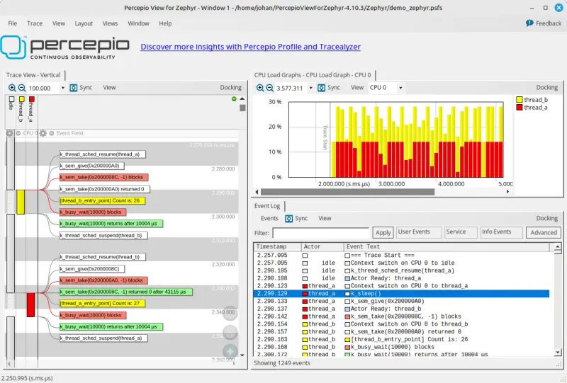
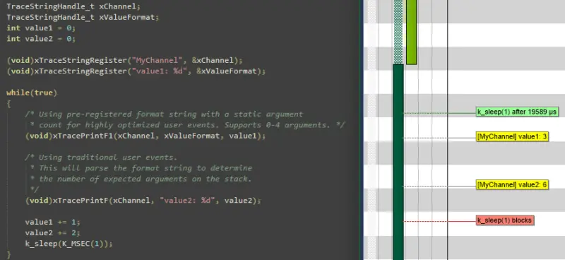

.. _tracing:

跟踪 (Tracing)
##############

概述 (Overview)
***************

跟踪功能提供钩子,允许您从应用程序中收集数据,并允许在主机上运行的 :ref:`tools` 可视化内核和各种子系统的内部工作方式 (The tracing feature provides hooks that permits you to collect data from
your application and allows :ref:`tools` running on a host to visualize the inner-working of
the kernel and various subsystems)。

每个系统都有特定于应用程序的事件需要跟踪。从历史上看,这意味着 (Every system has application-specific events to trace out.  Historically,
that has implied):

1. 确定特定于应用程序的有效载荷 (Determining the application-specific payload),
2. 选择合适的序列化格式 (Choosing suitable serialization-format),
3. 编写目标上的序列化代码 (Writing the on-target serialization code),
4. 决定并编写 I/O 传输机制 (Deciding on and writing the I/O transport mechanics),
5. 编写 PC 端的反序列化器/解析器 (Writing the PC-side deserializer/parser),
6. 编写用于过滤和呈现的自定义临时工具 (Writing custom ad-hoc tools for filtering and presentation)。

应用程序可以使用现有格式之一,或通过覆盖 :zephyr_file:`include/zephyr/tracing/tracing.h` 中声明的宏来定义自定义格式 (An application can use one of the existing formats or define a custom format by
overriding the macros declared in :zephyr_file:`include/zephyr/tracing/tracing.h`)。

Zephyr 中提供并支持不同的格式、传输和主机工具 (Different formats, transports and host tools are available and supported in
Zephyr)。

事实上,I/O 在不同系统之间差异很大。因此,当我们必须确保有效载荷/格式 (顶层) 和传输机制 (底层) 之间的接口足够通用和高效以对这些进行建模时,为 I/O 类型创建分类法是有指导意义的。请参见下面的 *I/O 分类法* 部分 (In fact, I/O varies greatly from system to system.  Therefore, it is
instructive to create a taxonomy for I/O types when we must ensure the
interface between payload/format (Top Layer) and the transport mechanics
(bottom Layer) is generic and efficient enough to model these. See the
*I/O taxonomy* section below)。

命名跟踪事件 (Named Trace Events)
**********************************

尽管用户可以扩展任何支持的序列化格式以启用其他跟踪功能 (或提供自己的后端),但 Zephyr 还为方便起见提供了一个通用的命名跟踪功能,并演示如何扩展跟踪框架 (Although the user can extend any of the supported serialization formats
to enable additional tracing functions (or provide their own backend), zephyr
also provides one generic named tracing function for convenience purposes,
as well as to demonstrate how tracing frameworks could be extended)。

用户可以通过调用 :c:func:`sys_trace_named_event` 生成自定义跟踪事件,该函数采用事件名称以及两个任意的 4 字节参数。如果提供的事件名称对于它们支持的序列化格式来说太长,则跟踪后端可能会截断它 (Users can generate a custom trace event by calling
:c:func:`sys_trace_named_event`, which takes an event name as well as two
arbitrary 4 byte arguments. Tracing backends may truncate the provided event
name if it is too long for the serialization format they support)。

序列化格式 (Serialization Formats)
***********************************

.. _ctf:

通用跟踪格式 (CTF) 支持 (Common Trace Format (CTF) Support)
=============================================================

通用跟踪格式 (CTF) 是一种用于描述跟踪格式的开放格式和语言。这使得工具可以重用,其中已经存在行文本 (babeltrace) 和图形 (TraceCompass) 变体 (Common Trace Format, CTF, is an open format and language to describe trace
formats. This enables tool reuse, of which line-textual (babeltrace) and
graphical (TraceCompass) variants already exist)。

CTF 对 C 程序员来说应该很熟悉,但增加了更强的类型。请参见 `CTF - A Flexible, High-performance Binary Trace Format
<https://diamon.org/ctf/>`_。

CTF 允许我们正式描述应用程序特定的有效载荷和序列化格式,这为主机工具、解析器以及用于过滤和呈现的工具提供了通用基础设施 (CTF allows us to formally describe application specific payload and the
serialization format, which enables common infrastructure for host tools
and parsers and tools for filtering and presentation)。

通用接口 (A Generic Interface)
-------------------------------

在 CTF 中,事件被序列化到包含一个或多个字段的数据包中。如下面的 *I/O 分类法* 部分所示,底层可能 (In CTF, an event is serialized to a packet containing one or more fields.
As seen from *I/O taxonomy* section below, a bottom layer may):

- 在事务开始时执行操作 (例如互斥锁定) (perform actions at transaction-start (e.g. mutex-lock)),
- 以某种方式处理每个字段 (例如同步推送发射、连接、入队到线程绑定的 FIFO) (process each field in some way (e.g. sync-push emit, concat, enqueue to
  thread-bound FIFO)),
- 在事务停止时执行操作 (例如互斥释放、连接缓冲区的发射) (perform actions at transaction-stop (e.g. mutex-release, emit of concat
  buffer))。

CTF 顶层示例 (CTF Top-Layer Example)
-------------------------------------

CTF_EVENT 宏将每个参数序列化到一个字段 (The CTF_EVENT macro will serialize each argument to a field)::

  /* Example for illustration */
  static inline void ctf_top_foo(uint32_t thread_id, ctf_bounded_string_t name)
  {
    CTF_EVENT(
      CTF_LITERAL(uint8_t, 42),
      thread_id,
      name,
      "hello, I was emitted from function: ",
      __func__  /* __func__ is standard since C99 */
    );
  }

如何序列化和发射字段以及处理对齐,可以在底层内部静态地在编译时完成 (How to serialize and emit fields as well as handling alignment, can be done
internally and statically at compile-time in the bottom-layer)。

CTF 顶层使用配置选项 :kconfig:option:`CONFIG_TRACING_CTF` 启用,并且可以在同步和异步模式下与不同的传输后端一起使用 (The CTF top layer is enabled using the configuration option
:kconfig:option:`CONFIG_TRACING_CTF` and can be used with the different transport
backends both in synchronous and asynchronous modes)。

.. _tools:

跟踪工具 (Tracing Tools)
*************************

Zephyr 包含对几种流行跟踪工具的支持,按字母顺序如下所示 (Zephyr includes support for several popular tracing tools, presented below in alphabetical order)。

Percepio Tracealyzer 支持 (Percepio Tracealyzer Support)
=========================================================

Zephyr 包含对 `Percepio Tracealyzer`_ 的支持,该工具提供跟踪可视化以简化分析、报告生成和其他分析功能。Tracealyzer 允许通过各种接口进行跟踪流式传输,还支持快照跟踪,其中事件保存在 RAM 缓冲区中 (Zephyr includes support for `Percepio Tracealyzer`_ that offers trace visualization for
simplified analysis, report generation and other analysis features. Tracealyzer allows for trace
streaming over various interfaces and also snapshot tracing, where the events are kept in a RAM
buffer.

.. _Percepio Tracealyzer: https://percepio.com/tracealyzer

.. figure:: percepio_tracealyzer.png
    :align: center
    :alt: Percepio Tracealyzer
    :figclass: align-center
    :width: 80%

启用 Tracealyzer 跟踪后,Zephyr 内核事件会自动捕获。Tracealyzer 还为应用程序日志记录提供了广泛的支持,您可以从应用程序代码中调用跟踪库。这使您可以一起可视化内核事件和应用程序事件,例如作为数据图或记录变量的状态图。在应用程序随附的 Tracealyzer 用户手册中了解更多信息 (Zephyr kernel events are captured automatically when Tracealyzer tracing is enabled.
Tracealyzer also provides extensive support for application logging, where you call the tracing
library from your application code. This lets you visualize kernel events and application events
together, for example as data plots or state diagrams on logged variables.
Learn more in the Tracealyzer User Manual provided with the application)。

Percepio TraceRecorder 和流端口 (Percepio TraceRecorder and Stream Ports)
--------------------------------------------------------------------------
Tracealyzer 的跟踪库 (TraceRecorder) 包含在 Zephyr 清单中,并在相同的许可证 (Apache 2.0) 下提供。通过在 prj.conf 中添加以下配置选项来启用它 (The tracing library for Tracealyzer (TraceRecorder) is included in the Zephyr manifest and
provided under the same license (Apache 2.0). This is enabled by adding the following
configuration options in your prj.conf):

.. code-block:: cfg

    CONFIG_TRACING=y
    CONFIG_PERCEPIO_TRACERECORDER=y

或使用 menuconfig (Or using menuconfig):

* 启用 :menuselection:`Subsystems and OS Services --> Tracing Support`
* 在 :menuselection:`Subsystems and OS Services --> Tracing Support --> Tracing Format` 下,选择
  :guilabel:`Percepio Tracealyzer`

需要一些额外的设置来配置 TraceRecorder。最重要的配置是选择正确的"流端口"。这指定了如何输出跟踪数据。截至 2024 年 7 月,Zephyr 配置系统中提供以下流端口 (Some additional settings are needed to configure TraceRecorder. The most important configuration
is to select the right "stream port". This specifies how to output the trace data.
As of July 2024, the following stream ports are available in the Zephyr configuration system):

* **环形缓冲区 (Ring Buffer)**: 跟踪数据保存在循环 RAM 缓冲区中 (The trace data is kept in a circular RAM buffer)。
* **RTT**: 通过 J-Link 调试探针上的 Segger RTT 进行跟踪流式传输 (Trace streaming via Segger RTT on J-Link debug probes)。
* **ITM**: 通过 Arm Cortex-M 设备上的 ITM 功能进行跟踪流式传输 (Trace streaming via the ITM function on Arm Cortex-M devices)。
* **半主机 (Semihost)**: 用于 QEMU 上的跟踪。将跟踪数据流式传输到主机文件 (For tracing on QEMU. Streams the trace data to a host file)。

在 menuconfig 中选择流端口,位于 (Select the stream port in menuconfig under)
:menuselection:`Modules --> percepio --> TraceRecorder --> Stream Port`。

或者只需在 prj.conf 中添加以下选项之一 (Or simply add one of the following options in your prj.conf):

.. code-block:: cfg

    CONFIG_PERCEPIO_TRC_CFG_STREAM_PORT_RINGBUFFER=y
    CONFIG_PERCEPIO_TRC_CFG_STREAM_PORT_RTT=y
    CONFIG_PERCEPIO_TRC_CFG_STREAM_PORT_ITM=y
    CONFIG_PERCEPIO_TRC_CFG_STREAM_PORT_ZEPHYR_SEMIHOST=y

确保只包含这些配置选项中的一个 (Make sure to only include ONE of these configuration options)。

流端口模块具有各自的配置选项。在 menuconfig 中,这些选项位于 :menuselection:`Modules --> percepio --> TraceRecorder --> (Stream Port) Config` 下。下面描述了每个流端口的最重要选项 (The stream port modules have individual configuration options. In menuconfig these are found
under :menuselection:`Modules --> percepio --> TraceRecorder --> (Stream Port) Config`.
The most important options for each stream port are described below)。

Tracealyzer 快照跟踪 (环形缓冲区) (Tracealyzer Snapshot Tracing (Ring Buffer))
--------------------------------------------------------------------------------

"环形缓冲区"流端口将跟踪数据保存在设备上的 RAM 缓冲区中。默认情况下,这是一个循环缓冲区,这意味着它始终包含最新的数据。这用于转储跟踪数据的"快照",例如通过使用调试器。这通常只允许短跟踪,除非您有大量 RAM 可用,因此不适合性能分析。但是,它与断点结合使用对调试非常有用。例如,如果您在错误处理程序中设置断点,快照跟踪可以显示导致错误的事件序列。快照跟踪也很容易开始,因为它不依赖于任何特定的调试探针或其他开发工具 (The "Ring Buffer" stream port keeps the trace data in a RAM buffer on the device.
By default, this is a circular buffer, meaning that it always contains the most recent data.
This is used to dump "snapshots" of the trace data, e.g. by using the debugger. This usually only
allows for short traces, unless you have megabytes of RAM to spare, so it is not suitable for
profiling. However, it can be quite useful for debugging in combination with breakpoints.
For example, if you set a breakpoint in an error handler, a snapshot trace can show the sequence
of events leading up to the error. Snapshot tracing is also easy to begin with, since it doesn't
depend on any particular debug probe or other development tool)。

要使用环形缓冲区选项,请确保在 prj.cnf 中包含以下配置选项 (To use the Ring Buffer option, make sure to have the following configuration options in your
prj.cnf):

.. code-block:: cfg

    CONFIG_TRACING=y
    CONFIG_PERCEPIO_TRACERECORDER=y
    CONFIG_PERCEPIO_TRC_START_MODE_START=y
    CONFIG_PERCEPIO_TRC_CFG_STREAM_PORT_RINGBUFFER=y
    CONFIG_PERCEPIO_TRC_CFG_STREAM_PORT_RINGBUFFER_SIZE=<size in bytes>

Or if using menuconfig:

* Enable :menuselection:`Subsystems and OS Services --> Tracing Support`
* Under :menuselection:`Subsystems and OS Services --> Tracing Support --> Tracing Format`, select
  :guilabel:`Percepio Tracealyzer`
* Under :menuselection:`Modules --> percepio --> TraceRecorder --> Recorder Start Mode`, select
  :guilabel:`Start`
* Under :menuselection:`Modules --> percepio --> TraceRecorder --> Stream Port`, select
  :guilabel:`Ring Buffer`
* Under :menuselection:`Modules --> percepio --> TraceRecorder --> Ring Buffer Config --> Buffer Size`,
  set the buffer size in bytes.

The default buffer size can be reduced if you are tight on RAM, or increased if you have RAM to
spare and want longer traces. You may also optimize the Tracing Configuration settings to get
longer traces by filtering out less important events.
In menuconfig, see
:menuselection:`Subsystems and OS Services --> Tracing Support --> Tracing Configuration`.

To view the trace data, the easiest way is to start your debugger (west debug) and run the
following GDB command::

    dump binary value trace.bin *RecorderDataPtr

The resulting file is typically found in the root of the build folder, unless a different path is
specified. Open this file in Tracealyzer by selecting :menuselection:`File --> Open --> Open File`.

Tracealyzer Streaming with SEGGER RTT
-------------------------------------

Tracealyzer has built-in support for SEGGER RTT to receive trace data using a J-Link probe.
This allows for recording very long traces. To configure Zephyr for RTT streaming to Tracealyzer,
add the following configuration options in your prj.cnf:

.. code-block:: cfg

    CONFIG_TRACING=y
    CONFIG_PERCEPIO_TRACERECORDER=y
    CONFIG_PERCEPIO_TRC_START_MODE_START_FROM_HOST=y
    CONFIG_PERCEPIO_TRC_CFG_STREAM_PORT_RTT=y
    CONFIG_PERCEPIO_TRC_CFG_STREAM_PORT_RTT_UP_BUFFER_SIZE=<size in bytes>

Or if using menuconfig:

* Enable :menuselection:`Subsystems and OS Services --> Tracing Support`
* Under :menuselection:`Subsystems and OS Services --> Tracing Support --> Tracing Format`, select
  :guilabel:`Percepio Tracealyzer`
* Under :menuselection:`Modules --> percepio --> TraceRecorder --> Recorder Start Mode`, select
  :guilabel:`Start From Host`
* Under :menuselection:`Modules --> percepio --> TraceRecorder --> Stream Port`, select
  :guilabel:`RTT`
* Under :menuselection:`Modules --> percepio --> TraceRecorder --> RTT Config`, set the size of the
  RTT "up" buffer in bytes.

The setting :guilabel:`RTT buffer size up` sets the size of the RTT transmission buffer. This is important
for throughput. By default this buffer is quite large, 5000 bytes, to give decent performance
also on onboard J-Link debuggers (they are not as fast as the stand-alone probes).
If you are tight on RAM, you may consider reducing this setting. If using a regular J-Link probe
it is often sufficient with a much smaller buffer, e.g. 1 KB or less.

Learn more about RTT streaming in the Tracealyzer User Manual.
See Creating and Loading Traces -> Percepio TraceRecorder -> Using TraceRecorder v4.6 or later ->
Stream ports (or search for RTT).

Tracealyzer Streaming with Arm ITM
----------------------------------

This stream port is for Arm Cortex-M devices featuring the ITM unit. It is recommended to use a
fast debug probe that allows for SWO speeds of 10 MHz or higher. To use this stream port,
apply the following configuration options:

.. code-block:: cfg

    CONFIG_TRACING=y
    CONFIG_PERCEPIO_TRACERECORDER=y
    CONFIG_PERCEPIO_TRC_START_MODE_START=y
    CONFIG_PERCEPIO_TRC_CFG_STREAM_PORT_ITM=y
    CONFIG_PERCEPIO_TRC_CFG_ITM_PORT=1

Or if using menuconfig:

* Enable :menuselection:`Subsystems and OS Services --> Tracing Support`
* Under :menuselection:`Subsystems and OS Services --> Tracing Support --> Tracing Format`, select
  :guilabel:`Percepio Tracealyzer`
* Under :menuselection:`Modules --> percepio --> TraceRecorder --> Recorder Start Mode`, select
  :guilabel:`Start`
* Under :menuselection:`Modules --> percepio --> TraceRecorder --> Stream Port`, select
  :guilabel:`ITM`
* Under :menuselection:`Modules --> percepio --> TraceRecorder --> ITM Config`, set the ITM port to
  1.

The main setting for the ITM stream port is the ITM port (0-31). A dedicated channel is needed
for Tracealyzer. Port 0 is usually reserved for printf logging, so channel 1 is used by default.

The option :guilabel:`Use internal buffer` should typically remain disabled. It buffers the data in RAM
before transmission and defers the data transmission to the periodic TzCtrl thread.

The host-side setup depends on what debug probe you are using. Learn more in the Tracealyzer
User Manual.
See :menuselection:`Creating and Loading Traces --> Percepio TraceRecorder --> Using TraceRecorder v4.6 or later --> Stream ports (or search for ITM)`.

Tracealyzer Streaming from QEMU (Semihost)
------------------------------------------

This stream port is designed for Zephyr tracing in QEMU. This can be an easy way to get started
with tracing and try out streaming trace without needing a fast debug probe. The data is streamed
to a host file using semihosting. To use this option, apply the following configuration options:

.. code-block:: cfg

    CONFIG_SEMIHOST=y
    CONFIG_TRACING=y
    CONFIG_PERCEPIO_TRACERECORDER=y
    CONFIG_PERCEPIO_TRC_START_MODE_START=y
    CONFIG_PERCEPIO_TRC_CFG_STREAM_PORT_ZEPHYR_SEMIHOST=y

Using menuconfig

* Enable :menuselection:`General Architecture Options --> Semihosting support for Arm and RISC-V targets`
* Enable :menuselection:`Subsystems and OS Services --> Tracing Support`
* Under :menuselection:`Subsystems and OS Services --> Tracing Support --> Tracing Format`, select
  :guilabel:`Percepio Tracealyzer`
* Under :menuselection:`Modules --> percepio --> TraceRecorder --> Recorder Start Mode`, select
  :guilabel:`Start`
* Under :menuselection:`Modules --> percepio --> TraceRecorder --> Stream Port`, select
  :guilabel:`Semihost`

By default, the resulting trace file is found in :file:`./trace.psf` in the root of the build folder,
unless a different path is specified. Open this file in `Percepio Tracealyzer`_ by selecting
:menuselection:`File --> Open --> Open File`.

Recorder Start Mode
-------------------

You may have noticed the :guilabel:`Recorder Start Mode` option in the Tracealyzer examples above.
This decides when the tracing starts. With the option :guilabel:`Start`, the tracing begins directly
at startup, once the TraceRecorder library has been initialized. This is recommended when using the
Ring Buffer and Semihost stream ports.

For streaming via RTT or ITM you may also use :guilabel:`Start From Host` or
:guilabel:`Start Await Host`. Both listens for start commands from the Tracealyzer application. The
latter option, :guilabel:`Start Await Host`, causes the TraceRecorder initialization to block until
the start command is received from the Tracealyzer application.

Custom Stream Ports for Tracealyzer
-----------------------------------

The stream ports are small modules within TraceRecorder that define what functions to call to
output the trace data and (optionally) how to read start/stop commands from Tracealyzer.
It is fairly easy to make custom stream ports to implement your own data transport and
Tracealyzer can receive trace streams over various interfaces, including files, sockets,
COM ports, named pipes and more. Note that additional stream port modules are available in the
TraceRecorder repo (e.g. lwIP), although they might require modifications to work with Zephyr.

Learning More
-------------

Learn more about how to get started in the `Tracealyzer Getting Started Guides`_.

.. _Tracealyzer Getting Started Guides: https://percepio.com/tracealyzer/gettingstarted/

Percepio View for Zephyr
========================
Percepio View is a free-of-charge tracing tool based on `Percepio Tracealyzer`_, intended for
debugging and verification of Zephyr applications.

Percepio View can be used side-by-side with a traditional debugger and complements your debugger
by visualising the real-time execution of threads, ISRs, syscalls and your own “User Events”.

要了解有关 Percepio View、如何开始使用和升级选项的更多信息,请查看 (To learn more about Percepio View, how to get started and upgrade options, check out)
`Percepio's product page
<https://traceviewer.io/get-view/?target=zephyr>`_。

Percepio View 提供快照跟踪,这意味着数据存储到目标 RAM 中的环形缓冲区,并使用常规调试器连接保存到主机。对于跟踪流式传输支持,Percepio 提供 (付费) 升级到 Percepio Profile 或 Percepio Tracealyzer。无需修改 Zephyr 源代码,仅需在 Kconfig 中启用 TraceRecorder 库。Percepio View 在 Windows 和 Linux 主机上运行 (Percepio View provides snapshot tracing, meaning the data is stored to a ring-buffer in target RAM
and is saved to host using the regular debugger connection.
For trace streaming support, Percepio offers (paid-for) upgrades to Percepio Profile or
Percepio Tracealyzer. No modifications of the Zephyr source code are needed, only enabling the
TraceRecorder library in Kconfig. Percepio View runs on Windows and Linux hosts)。

SEGGER SystemView 支持 (SEGGER SystemView Support)
===================================================

Zephyr 为 `SEGGER SystemView`_ 提供内置支持,可以在具有所需硬件支持的平台上的任何应用程序中启用 (Zephyr provides built-in support for `SEGGER SystemView`_ that can be enabled in
any application for platforms that have the required hardware support)。

SystemView 使用的有效载荷和格式是应用程序自定义的,并依赖 RTT 作为传输。较新版本的 SystemView 支持其他传输,例如 UART 或使用快照模式 (两者在 Zephyr 中仍不受支持) (The payload and format used with SystemView is custom to the application and
relies on RTT as a transport. Newer versions of SystemView support other
transports, for example UART or using snapshot mode (both still not
supported in Zephyr))。

要启用 `SEGGER SystemView`_ 的跟踪支持,请将 :ref:`snippet-rtt-tracing` 添加到您的构建命令中 (To enable tracing support with `SEGGER SystemView`_ add the
:ref:`snippet-rtt-tracing` to your build command):

    .. zephyr-app-commands::
        :zephyr-app: samples/synchronization
        :board: <board>
        :snippets: rtt-tracing
        :goals: build
        :compact:

SystemView 也可以用于事后跟踪,可以使用 :kconfig:option:`CONFIG_SEGGER_SYSVIEW_POST_MORTEM_MODE` 启用。在此模式下,可以在系统崩溃后使用 ``west attach`` 连接调试器,之后可以将内部 RAM 缓冲区中的最新数据加载到 SystemView 中 (SystemView can also be used for post-mortem tracing, which can be enabled with
:kconfig:option:`CONFIG_SEGGER_SYSVIEW_POST_MORTEM_MODE`. In this mode, a debugger can
be attached after the system has crashed using ``west attach`` after which the
latest data from the internal RAM buffer can be loaded into SystemView)。

.. figure:: segger_systemview.png
    :align: center
    :alt: SEGGER SystemView
    :figclass: align-center
    :width: 80%

.. _SEGGER SystemView: https://www.segger.com/products/development-tools/systemview/

最近版本的 `SEGGER SystemView`_ 带有用于 Zephyr 的 API 转换表,该表不完整且与 Zephyr 中可用的当前支持级别不匹配。要使用最新的 Zephyr API 描述表,请将树中可用的文件复制到本地配置目录以覆盖内置表 (Recent versions of `SEGGER SystemView`_ come with an API translation table for
Zephyr which is incomplete and does not match the current level of support
available in Zephyr. To use the latest Zephyr API description table, copy the
file available in the tree to your local configuration directory to override the
builtin table)::

        # On Linux and MacOS
        cp $ZEPHYR_BASE/subsys/tracing/sysview/SYSVIEW_Zephyr.txt ~/.config/SEGGER/

TraceCompass
=============

TraceCompass 是一个开源工具,可视化 CTF 事件,例如线程调度和中断,并有助于在复杂系统上发现意外交互和资源冲突 (TraceCompass is an open source tool that visualizes CTF events such as thread
scheduling and interrupts, and is helpful to find unintended interactions and
resource conflicts on complex systems)。

另请参见 Ericsson 的演示 (See also the presentation by Ericsson),
`Advanced Trouble-shooting Of Real-time Systems
<https://wiki.eclipse.org/images/0/0e/TechTalkOnlineDemoFeb2017_v1.pdf>`_。

用户自定义跟踪 (User-Defined Tracing)
======================================

此跟踪格式允许用户定义函数,以在切换任务进出、进入或退出中断以及 CPU 空闲时执行任何所需的工作 (This tracing format allows the user to define functions to perform any work desired
when a task is switched in or out, when an interrupt is entered or exited, and when the cpu
is idle)。

示例包括 (Examples include):
- 简单切换 GPIO 用于外部示波器跟踪,同时最小化额外的 CPU 负载 (simple toggling of GPIO for external scope tracing while minimizing extra cpu load)
- 生成/输出非标准或专有格式的跟踪数据,其他跟踪系统无法支持 (generating/outputting trace data in a non-standard or proprietary format that can
not be supported by the other tracing systems)

用户可以定义以下函数 (The following functions can be defined by the user):

.. code-block:: c

   void sys_trace_thread_create_user(struct k_thread *thread);
   void sys_trace_thread_abort_user(struct k_thread *thread);
   void sys_trace_thread_suspend_user(struct k_thread *thread);
   void sys_trace_thread_resume_user(struct k_thread *thread);
   void sys_trace_thread_name_set_user(struct k_thread *thread);
   void sys_trace_thread_switched_in_user(struct k_thread *thread);
   void sys_trace_thread_switched_out_user(struct k_thread *thread);
   void sys_trace_thread_info_user(struct k_thread *thread);
   void sys_trace_thread_sched_ready_user(struct k_thread *thread);
   void sys_trace_thread_pend_user(struct k_thread *thread);
   void sys_trace_thread_priority_set_user(struct k_thread *thread, int prio);
   void sys_trace_isr_enter_user(int nested_interrupts);
   void sys_trace_isr_exit_user(int nested_interrupts);
   void sys_trace_idle_user();

使用 :kconfig:option:`CONFIG_TRACING_USER` 选项启用此格式 (Enable this format with the :kconfig:option:`CONFIG_TRACING_USER` option)。

传输后端 (Transport Backends)
******************************

当前支持以下后端 (The following backends are currently supported):

* UART
* USB
* 文件 (使用基于 POSIX 架构的目标的本机端口) (File (Using the native port with POSIX architecture based targets))
* RTT (与 SystemView 一起) (RTT (With SystemView))
* RAM (由调试器检索的缓冲区) (RAM (buffer to be retrieved by a debugger))

使用跟踪 (Using Tracing)
*************************

示例 :zephyr_file:`samples/subsys/tracing` 演示了使用不同格式和后端的跟踪 (The sample :zephyr_file:`samples/subsys/tracing` demonstrates tracing with
different formats and backends)。

要开始,最简单的方法是在 :zephyr:board:`native_sim <native_sim>` 端口上使用 CTF 格式,按如下方式构建示例 (To get started, the simplest way is to use the CTF format with the
:zephyr:board:`native_sim <native_sim>` port, build the sample as follows):

.. zephyr-app-commands::
   :tool: all
   :zephyr-app: samples/subsys/tracing
   :board: native_sim
   :gen-args: -DCONF_FILE=prj_native_ctf.conf
   :goals: build

然后,您可以使用选项 ``-trace-file`` 运行生成的二进制文件以生成跟踪数据 (You can then run the resulting binary with the option ``-trace-file`` to generate
the tracing data)::

    mkdir data
    cp $ZEPHYR_BASE/subsys/tracing/ctf/tsdl/metadata data/
    ./build/zephyr/zephyr.exe -trace-file=data/channel0_0

生成的 CTF 输出可以使用 babeltrace 或 TraceCompass 进行可视化,方法是将工具指向包含元数据和跟踪文件的 ``data`` 目录 (The resulting CTF output can be visualized using babeltrace or TraceCompass
by pointing the tool to the ``data`` directory with the metadata and trace files)。

使用 RAM 后端 (Using RAM backend)
==================================

对于没有可用于跟踪的 I/O (如 USB 或 UART) 但有足够 RAM 来收集跟踪数据的设备,可以使用配置 :kconfig:option:`CONFIG_TRACING_BACKEND_RAM` 启用 RAM 后端 (For devices that do not have available I/O for tracing such as USB or UART but have
enough RAM to collect trace data, the ram backend can be enabled with configuration
:kconfig:option:`CONFIG_TRACING_BACKEND_RAM`)。
调整 :kconfig:option:`CONFIG_RAM_TRACING_BUFFER_SIZE` 以能够为您的需求记录足够的跟踪。然后借助运行时调试器 (如 gdb),可以将此缓冲区从目标提取到主机计算机 (Adjust :kconfig:option:`CONFIG_RAM_TRACING_BUFFER_SIZE` to be able to record enough traces for your needs.
Then thanks to a runtime debugger such as gdb this buffer can be fetched from the target
to an host computer)::

    (gdb) dump binary memory data/channel0_0 <ram_tracing_start> <ram_tracing_end>

生成的 channel0_0 文件必须与 ``metadata`` 文件一起放置在目录中,就像其他后端一样 (The resulting channel0_0 file have to be placed in a directory with the ``metadata``
file like the other backend)。

未来的 LTTng 启发 (Future LTTng Inspiration)
**********************************************

目前,这里提供的顶层相当简单和基础,并且不必要地从 Zephyr 的 Segger SystemView 调试模块复制 (Currently, the top-layer provided here is quite simple and bare-bones,
and needlessly copied from Zephyr's Segger SystemView debug module)。

对于像 Zephyr 这样的操作系统,从 Linux 的 LTTng 中汲取灵感并将顶层更改为序列化为相同格式是有意义的。这样做将使 TraceCompass 的 Linux 罐装分析能够直接重用。或者,TraceCompass 中的 LTTng 分析可以定制为 Zephyr。目前正在进行的工作是以目标无关和开源的方式启用 TraceCompass 对 Zephyr 的可见性 (For an OS like Zephyr, it would make sense to draw inspiration from
Linux's LTTng and change the top-layer to serialize to the same format.
Doing this would enable direct reuse of TraceCompass' canned analyses
for Linux.  Alternatively, LTTng-analyses in TraceCompass could be
customized to Zephyr.  It is ongoing work to enable TraceCompass
visibility of Zephyr in a target-agnostic and open source way)。

I/O 分类法 (I/O Taxonomy)
==========================

- 原子推送/生成/写入/入队 (Atomic Push/Produce/Write/Enqueue):

  - 同步 (synchronous):
                  意味着数据传输在调用返回时已完成 (means data-transmission has completed with the return of the
                  call)。

  - 异步 (asynchronous):
                  意味着数据传输在调用返回时正在挂起或正在进行。通常,使用中断/回调/信号或轮询来确定完成 (means data-transmission is pending or ongoing with the return
                  of the call. Usually, interrupts/callbacks/signals or polling
                  is used to determine completion)。

  - 缓冲 (buffered):
                  意味着数据传输被复制并组合在一起以形成更大的传输。通常用于摊销开销 (突发出队) 或抖动缓解 (稳定出队) (means data-transmissions are copied and grouped together to
                  form a larger ones. Usually for amortizing overhead (burst
                  dequeue) or jitter-mitigation (steady dequeue))。

  示例 (Examples):
    - sync  unbuffered
        例如通过 GPIO 的 PIO,具有稳定流,不需要额外的 FIFO 内存。抖动低但可能效率较低 (无法摊销写入的开销) (E.g. PIO via GPIOs having steady stream, no extra FIFO memory needed.
        Low jitter but may be less efficient (can't amortize the overhead of
        writing))。

    - sync  buffered
        例如 ``fwrite()`` 或入队到 FIFO。当其缓冲区水位超过阈值时阻塞性地突发 FIFO。由于突发导致的抖动可能导致错过截止时间 (E.g. ``fwrite()`` or enqueuing into FIFO.
        Blockingly burst the FIFO when its buffer-waterlevel exceeds threshold.
        Jitter due to bursts may lead to missed deadlines)。

    - async unbuffered
        例如 DMA 或共享内存中的零拷贝。小心数据危害、竞争条件等 (E.g. DMA, or zero-copying in shared memory.
        Be careful of data hazards, race conditions, etc)!

    - async buffered
        E.g. enqueuing into FIFO.

- Atomic Pull/Consume/Read/Dequeue:

  - synchronous:
                  means data-reception has completed with the return of the call.

  - asynchronous:
                  means data-reception is pending or ongoing with the return of
                  the call. Usually, interrupts/callbacks/signals or polling is
                  used to determine completion.

  - buffered:
                  means data is copied-in in larger chunks than request-size.
                  Usually for amortizing wait-time.

  Examples:
    - sync  unbuffered
        E.g. Blocking read-call, ``fread()`` or SPI-read, zero-copying in shared
        memory.

    - sync  buffered
        E.g. Blocking read-call with caching applied.
        Makes sense if read pattern exhibits spatial locality.

    - async unbuffered
        E.g. zero-copying in shared memory.
        Be careful of data hazards, race conditions, etc!

    - async buffered
        E.g. ``aio_read()`` or DMA.

Unfortunately, I/O may not be atomic and may, therefore, require locking.
Locking may not be needed if multiple independent channels are available.

  - The system has non-atomic write and one shared channel
        E.g. UART. Locking required.

        ``lock(); emit(a); emit(b); emit(c); release();``

  - The system has non-atomic write but many channels
        E.g. Multi-UART. Lock-free if the bottom-layer maps each Zephyr
        thread+ISR to its own channel, thus alleviating races as each
        thread is sequentially consistent with itself.

        ``emit(a,thread_id); emit(b,thread_id); emit(c,thread_id);``

  - The system has atomic write     but one shared channel
        E.g. ``native_sim`` or board with DMA. May or may not need locking.

        ``emit(a ## b ## c); /* Concat to buffer */``

        ``lock(); emit(a); emit(b); emit(c); release(); /* No extra mem */``

  - 系统具有原子写入和多个通道 (The system has atomic write     and many channels)
        例如 native_sim 或具有多通道 DMA 的开发板。无锁 (E.g. native_sim or board with multi-channel DMA. Lock-free)。

        ``emit(a ## b ## c, thread_id);``

对象跟踪 (Object tracking)
***************************

内核还可以维护可用于跟踪其使用情况的对象列表。目前,可以启用以下列表 (The kernel can also maintain lists of objects that can be used to track
their usage. Currently, the following lists can be enabled)::

  struct k_timer *_track_list_k_timer;
  struct k_mem_slab *_track_list_k_mem_slab;
  struct k_sem *_track_list_k_sem;
  struct k_mutex *_track_list_k_mutex;
  struct k_stack *_track_list_k_stack;
  struct k_msgq *_track_list_k_msgq;
  struct k_mbox *_track_list_k_mbox;
  struct k_pipe *_track_list_k_pipe;
  struct k_queue *_track_list_k_queue;
  struct k_event *_track_list_k_event;

这些全局变量是每个列表的头 - 可以在宏 ``SYS_PORT_TRACK_NEXT`` 的帮助下遍历它们。例如,要遍历所有初始化的互斥锁,可以编写 (Those global variables are the head of each list - they can be traversed
with the help of macro ``SYS_PORT_TRACK_NEXT``. For instance, to traverse
all initialized mutexes, one can write)::

  struct k_mutex *cur = _track_list_k_mutex;
  while (cur != NULL) {
    /* Do something */

    cur = SYS_PORT_TRACK_NEXT(cur);
  }

要启用对象跟踪,请启用 :kconfig:option:`CONFIG_TRACING_OBJECT_TRACKING`。请注意,每个列表都可以通过其跟踪配置启用或禁用。例如,要禁用信号量的跟踪,可以禁用 :kconfig:option:`CONFIG_TRACING_SEMAPHORE` (To enable object tracking, enable :kconfig:option:`CONFIG_TRACING_OBJECT_TRACKING`.
Note that each list can be enabled or disabled via their tracing
configuration. For example, to disable tracking of semaphores, one can
disable :kconfig:option:`CONFIG_TRACING_SEMAPHORE`)。

对象跟踪位于跟踪配置之后,因为它目前利用跟踪基础设施来执行跟踪 (Object tracking is behind tracing configuration as it currently leverages
tracing infrastructure to perform the tracking)。

API
***

通用 (Common)
=============

.. doxygengroup:: subsys_tracing_apis

线程 (Threads)
==============

.. doxygengroup:: subsys_tracing_apis_thread

工作队列 (Work Queues)
=======================

.. doxygengroup:: subsys_tracing_apis_work

轮询 (Poll)
===========

.. doxygengroup:: subsys_tracing_apis_poll

信号量 (Semaphore)
==================

.. doxygengroup:: subsys_tracing_apis_sem

互斥锁 (Mutex)
==============

.. doxygengroup:: subsys_tracing_apis_mutex

条件变量 (Condition Variables)
===============================

.. doxygengroup:: subsys_tracing_apis_condvar

队列 (Queues)
=============

.. doxygengroup:: subsys_tracing_apis_queue

FIFO
====

.. doxygengroup:: subsys_tracing_apis_fifo

LIFO
====
.. doxygengroup:: subsys_tracing_apis_lifo

栈 (Stacks)
===========

.. doxygengroup:: subsys_tracing_apis_stack

消息队列 (Message Queues)
==========================

.. doxygengroup:: subsys_tracing_apis_msgq

邮箱 (Mailbox)
==============

.. doxygengroup:: subsys_tracing_apis_mbox

管道 (Pipes)
============

.. doxygengroup:: subsys_tracing_apis_pipe

堆 (Heaps)
==========

.. doxygengroup:: subsys_tracing_apis_heap

内存片 (Memory Slabs)
======================

.. doxygengroup:: subsys_tracing_apis_mslab

定时器 (Timers)
===============

.. doxygengroup:: subsys_tracing_apis_timer

对象跟踪 (Object tracking)
===========================

.. doxygengroup:: subsys_tracing_object_tracking

系统调用 (Syscalls)
====================

.. doxygengroup:: subsys_tracing_apis_syscall

网络跟踪 (Network tracing)
===========================

.. doxygengroup:: subsys_tracing_apis_net

网络套接字跟踪 (Network socket tracing)
========================================

.. doxygengroup:: subsys_tracing_apis_socket
